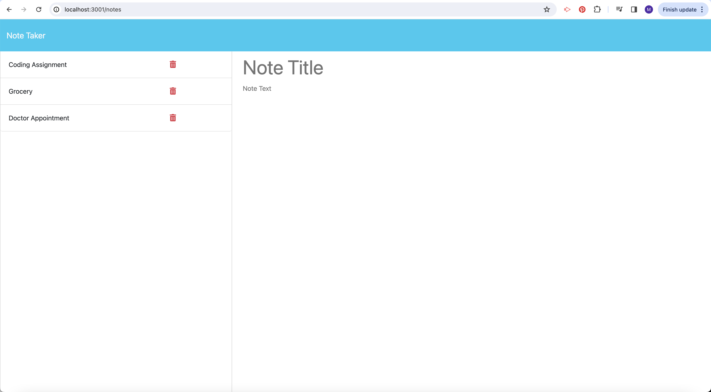

# Note-Taker

Module 11 Challenge

## Description

For this project, our task was to improve an existing code for web accessibility.  
Throughout this process, we learned to identify individual sections within the HTML file and implement semantic tags to improve accessibility.
I have learned to write more concise CSS style sheets and reorganizing the codebase for improved efficiency.

Below are the assigmemnt's requirements:

### User Story

* AS A small business owner
* I WANT to be able to write and save notes
* SO THAT I can organize my thoughts and keep track of tasks I need to complete

### Acceptance Criteria

* GIVEN a note-taking application
* WHEN I open the Note Taker
* THEN I am presented with a landing page with a link to a notes page
* WHEN I click on the link to the notes page
* THEN I am presented with a page with existing notes listed in the left-hand column, plus empty fields to enter a new note title and the note’s text in the right-hand column
* WHEN I enter a new note title and the note’s text
* THEN a "Save Note" button and a "Clear Form" button appear in the navigation at the top of the page
* WHEN I click on the Save button
* THEN the new note I have entered is saved and appears in the left-hand column with the other existing notes and the buttons in the navigation disappear
* WHEN I click on an existing note in the list in the left-hand column
* THEN that note appears in the right-hand column and a "New Note" button appears in the navigation
* WHEN I click on the "New Note" button in the navigation at the top of the page
* THEN I am presented with empty fields to enter a new note title and the note’s text in the right-hand column and the button disappears

## How to use it

Click on the 'Get Started' Button to acces to the Note Taker interface. Enter in the test fields the title of your task/note and write more information in the second text field. Once these fields completed, click on the 'Save Note' button to save your note. Once saved, it will appear in the left section of the screen. You can delete completed taks or old notes by click on the 'delete' button in red.

## Links

In order to complete this assignment, I have referred to a few resources:

* Solutions from activities and Mini-Project from module 11
* Used Xpert Learning Assistant about DELETE requests
* Tutoring session with Wesley Clement to debugg my code

## Deployed Application

https://limitless-stream-16633-5be9ab797eb8.herokuapp.com/notes

## Screenshots

